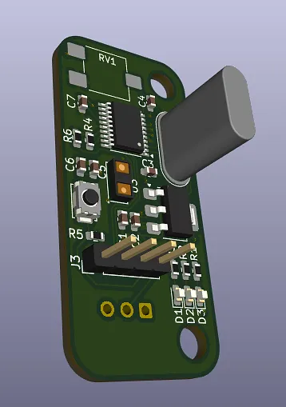
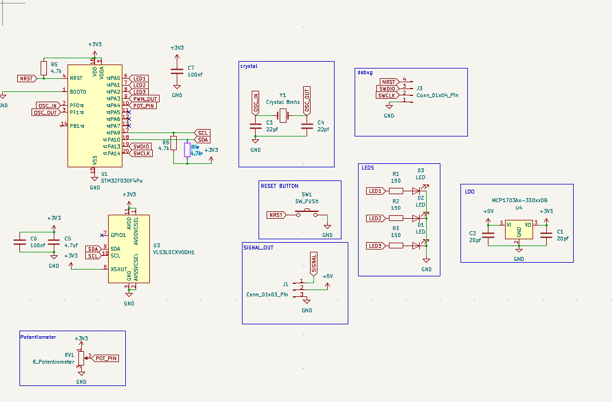
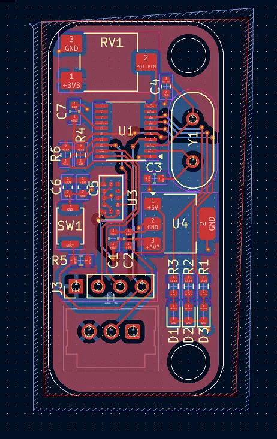

# STM32 Distance Sensor Node
A compact distance-sensing project using the STM32F030 MCU and a VL53L0X Time-of-Flight (ToF) sensor. 

This was made to be used as a object detection sensor.

## 3D Model (CAD)

## PCB Design

## BOM (Bill of Materials)
| Item Name                             | Link    | Cost (CAD) | Amount | Total (CAD) |
| ------------------------------------- | ------- | ---------: | -----: | ----------: |
| Ceramic Capacitor 0.1 μF 50V X7R 0603 | Digikey |      0.011 |     10 |        0.11 |
| Ceramic Capacitor 4.7 μF 10V X5R 0603 | Digikey |      0.006 |     10 |        0.06 |
| LED Orange Clear Chip SMD             | Digikey |       0.11 |      5 |        0.55 |
| LED Red Clear Chip SMD                | Digikey |       0.12 |      5 |        0.60 |
| LED Green Clear Chip SMD              | Digikey |       0.12 |      6 |        0.60 |
| Connector Header R/A 3-Pos 2.54 mm    | Digikey |       0.93 |      3 |        2.79 |
| Resistor SMD 150 Ω 0.1% 1/10W 0603    | Digikey |      0.061 |     10 |        0.61 |
| Resistor SMD 4.7 kΩ 1% 1/10W 0603     | Digikey |      0.034 |     10 |        0.34 |
| Trimmer 100 kΩ J-Lead Top             | Digikey |       0.25 |      7 |        1.75 |
| MCU STM32F030F4P6 32-bit 16KB         | Digikey |       1.52 |      3 |        4.56 |
| Optical Sensor VL53L1CXV0FY/1         | Digikey |       5.77 |      3 |       17.31 |
| Linear Regulator MCP1703AT-3302E      | Digikey |       0.75 |      3 |        2.25 |
| Ceramic Capacitor 18 pF 250V C0G 0603 | Digikey |      0.157 |     10 |        1.57 |
| Crystal 8.000 MHz HC-49/U             | Digikey |       0.49 |      3 |        1.47 |
| Ceramic Capacitor 1 μF 10V X7R 0603   | Digikey |      0.005 |     10 |        0.05 |
| Switch Tactile SPST-NO                | Digikey |       0.60 |      3 |        1.80 |
| Digikey Shipping                      | Digikey |      20.00 |      1 |       20.00 |
| Custom PCB                            | JLCPCB  |       7.65 |      1 |        7.65 |
| **Total CAD**                         |         |            |        |   **64.07** |
| **Total USD**                         |         |            |        |   **46.72** |
